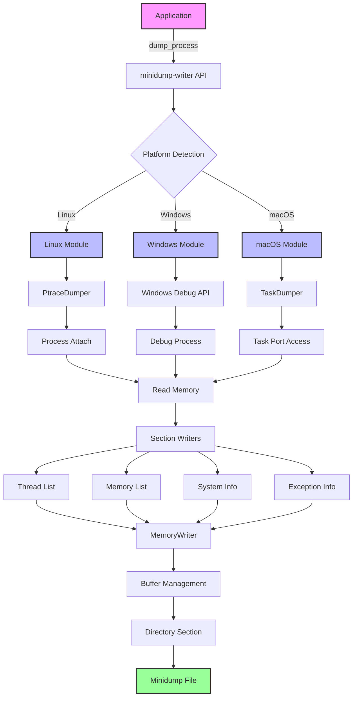

<!-- DOCGUIDE:META
title: "Architecture Documentation"
description: "Technical architecture and design principles for minidump-writer"
version: "1.0.0"
lastUpdated: "2025-07-17"
status: "active"
relatedDocs:
  - README.md: "Project overview and usage"
  - PRD.md: "iOS support requirements"
  - OVERVIEW.md: "High-level project overview"
  - CLAUDE.md: "Development guidance"
/DOCGUIDE:META -->

# Architecture Documentation

## High-Level Overview

`minidump-writer` is a cross-platform Rust library for generating minidump files, primarily designed for capturing crash information from external processes. It provides platform-specific implementations for Linux, Windows, and macOS, with iOS support under development.

### Core Purpose
- Generate minidump files compatible with Google Breakpad format
- Capture process state at crash time for post-mortem debugging
- Support both external process dumping and self-dumping scenarios
- Provide memory-efficient, streaming writes for large dumps

### Key Characteristics
- **Platform-Native**: Uses native debugging APIs (ptrace, Windows Debug API, Mach)
- **Memory-Efficient**: Streaming architecture minimizes memory overhead
- **Crash-Safe**: Designed to work reliably even when dumping crashed processes
- **Extensible**: Section-based architecture allows adding new data types

## Guiding Design Principles

### 1. Platform Abstraction with Native Performance
Each platform gets its own optimized implementation rather than forcing a common abstraction that compromises performance or capabilities.

### 2. External Process First
The architecture prioritizes dumping external processes over self-dumping, as self-dumping during crashes is inherently unreliable.

### 3. Fail-Safe Operation
The library must handle partial failures gracefully - a corrupted thread shouldn't prevent dumping other valid data.

### 4. Format Compliance
Strict adherence to the Google Breakpad minidump format ensures compatibility with existing analysis tools.

### 5. Minimal Dependencies
Platform implementations rely primarily on system APIs to reduce external dependencies and potential failure points.

## Development Principles

### Platform-Independent Principles

#### SOLID Principles
- **Single Responsibility**: Each module handles one aspect (e.g., `ptrace_dumper` only handles ptrace operations)
- **Open/Closed**: New minidump sections can be added without modifying core writers
- **Liskov Substitution**: Platform implementations are interchangeable through common traits
- **Interface Segregation**: Separate traits for different capabilities (dumping, memory reading, etc.)
- **Dependency Inversion**: Core logic depends on abstractions, not platform specifics

#### Clean Code Practices
- **Descriptive Naming**: Types like `PtraceDumper`, `TaskDumper` clearly indicate purpose
- **Small Functions**: Complex operations broken into digestible pieces
- **DRY**: Shared logic extracted to common modules (`mem_writer`, `dir_section`)
- **Self-Documenting**: Code structure mirrors minidump format structure

#### Error Handling Patterns
- **Fail Fast**: Validate inputs early, especially for external process operations
- **Graceful Degradation**: Missing optional sections don't fail entire dump
- **Detailed Errors**: Platform-specific error types with context
- **Recovery Strategies**: Retry logic for transient failures (e.g., process state changes)

#### Test Pyramid
- **Unit Tests**: Core logic tested in isolation
- **Integration Tests**: Platform APIs tested with real processes
- **End-to-End Tests**: Full dump generation and validation with `minidump-processor`

### Rust-Specific Principles

#### Memory Safety
- **Zero-Copy Where Possible**: Use references and slices over allocations
- **Lifetime Management**: Explicit lifetimes for cross-process memory references
- **Safe Abstractions**: Wrap unsafe platform APIs in safe Rust interfaces

#### Unsafe Code Guidelines
- **Minimize Unsafe Blocks**: Isolate unsafe code to platform-specific modules
- **Document Invariants**: Every unsafe block explains safety requirements
- **Audit Boundaries**: Clear separation between safe and unsafe interfaces
- **Platform Validation**: Verify system API contracts at runtime

#### Error Handling
- **Result Types**: All fallible operations return `Result<T, E>`
- **Custom Error Types**: Platform-specific errors with `thiserror`
- **Error Context**: Include relevant system information in errors
- **No Panics in Library**: Library code never panics, only returns errors

#### Concurrency Patterns
- **Send/Sync Traits**: Ensure thread safety where needed
- **No Global State**: All state passed explicitly
- **Platform Threading**: Respect platform-specific threading models

## Component Inventory

| Component | Type | Language | Purpose | Dependencies |
|-----------|------|----------|---------|--------------|
| `minidump-writer` | Library | Rust | Main library interface | `cfg_if`, platform modules |
| `linux/` | Platform Module | Rust | Linux/Android implementation | `libc`, `goblin`, `memmap2` |
| `windows/` | Platform Module | Rust | Windows implementation | `windows-sys`, `dbghelp.dll` |
| `mac/` | Platform Module | Rust | macOS implementation | `mach2`, system frameworks |
| `mem_writer` | Core Module | Rust | Memory buffer management | None (core only) |
| `dir_section` | Core Module | Rust | Directory section handling | `minidump-common` |
| `bin/minidump-writer` | Binary | Rust | CLI tool | Main library |
| `crash-context` | External Crate | Rust | Crash information provider | Platform-specific |

## Data & Control Flow



### Process Flow Description

1. **API Entry**: Client calls platform-agnostic API with process ID and options
2. **Platform Dispatch**: `cfg_if!` macro selects appropriate platform implementation
3. **Process Attachment**: Platform-specific mechanism attaches to target process
4. **Memory Access**: Platform APIs used to read process memory safely
5. **Section Generation**: Each section writer extracts specific data types
6. **Buffer Assembly**: `MemoryWriter` assembles sections with proper alignment
7. **Directory Creation**: Directory section indexes all minidump sections
8. **File Output**: Final minidump written to specified location

## Interface Contracts

### Public API Contract
```rust
pub trait MinidumpWriter {
    fn dump_process(
        pid: Pid,
        options: DumpOptions,
        output: &mut dyn Write,
    ) -> Result<(), Error>;
}
```

### Platform Implementation Contract
Each platform module must provide:
- Process attachment mechanism
- Memory reading capability
- Thread enumeration
- Module/library enumeration
- CPU context capture
- Exception information (if available)

### Section Writer Contract
```rust
pub trait SectionWriter {
    fn write_section(&self, buffer: &mut MemoryWriter) -> Result<MDRawDirectory>;
    fn section_type(&self) -> u32;
}
```

### Memory Access Contract
- Must handle unmapped memory gracefully
- Should validate address ranges before access
- Must respect process memory protections
- Should minimize process suspension time

## Error Handling & Resilience

### Error Categories

1. **Process Errors**
   - Process not found
   - Insufficient permissions
   - Process exited during dump

2. **Memory Errors**
   - Unmapped memory access
   - Protected memory regions
   - Allocation failures

3. **System Errors**
   - API call failures
   - Resource exhaustion
   - Platform limitations

### Resilience Strategies

1. **Partial Dumps**: Continue dumping even if some sections fail
2. **Retry Logic**: Retry transient failures with backoff
3. **Fallback Data**: Use alternative data sources when primary fails
4. **Resource Limits**: Enforce maximum dump sizes and timeouts
5. **Signal Safety**: iOS implementation uses pre-allocated buffers

## Platform-Specific Considerations

### Linux/Android
- **ptrace Limitations**: One tracer per process
- **Memory Mapping**: Parse `/proc/[pid]/maps` for memory layout
- **Architecture Support**: Handle x86, x86_64, ARM, ARM64
- **SELinux**: Handle security policy restrictions

### Windows
- **Debug Privileges**: Require appropriate access tokens
- **Symbol Access**: Integrate with Windows symbol infrastructure
- **WOW64**: Handle 32-bit processes on 64-bit Windows
- **Anti-Debug**: Respect anti-debugging flags

### macOS
- **Task Ports**: Require task_for_pid privileges
- **Code Signing**: Handle hardened runtime restrictions
- **Universal Binaries**: Support multiple architectures
- **System Integrity Protection**: Work within SIP constraints

### iOS (Planned)
- **Self-Process Only**: No external process access
- **Signal Safety**: Pre-allocated buffers for crash handling
- **Sandbox Restrictions**: Limited file system access
- **Memory Constraints**: Minimize allocations during crash

## Related Documentation

- [README.md](README.md) - Project overview and usage examples
- [PRD.md](PRD.md) - Detailed iOS support requirements
- [OVERVIEW.md](OVERVIEW.md) - High-level project description
- [CLAUDE.md](CLAUDE.md) - Development guidance for AI assistants
- [CHANGELOG.md](CHANGELOG.md) - Version history and changes

## Future Considerations

1. **WebAssembly Support**: Potential for browser crash reporting
2. **Async/Await**: Investigate async APIs for I/O operations
3. **Compression**: Optional minidump compression
4. **Encryption**: Support for encrypted crash dumps
5. **Cloud Integration**: Direct upload to crash reporting services